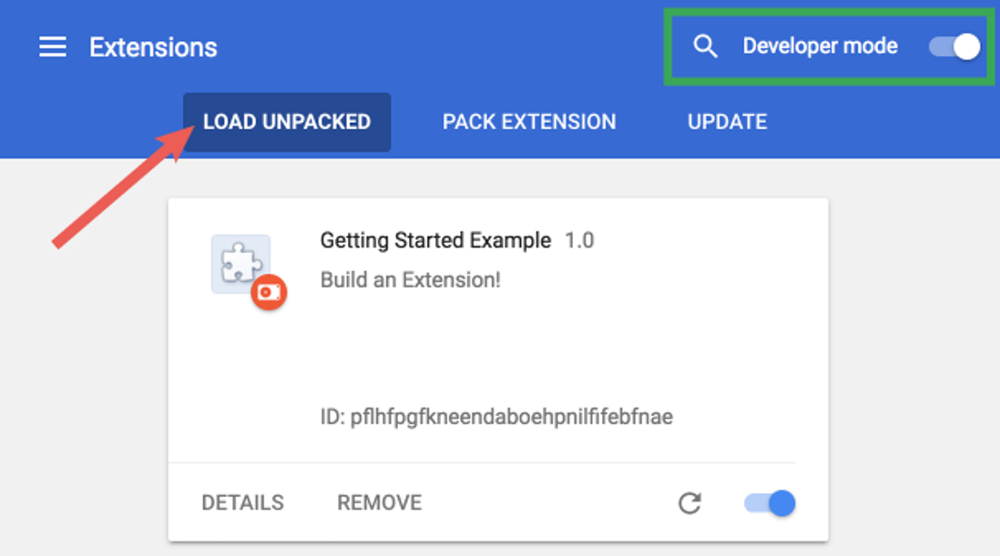

## How to record
1. Open the Extension Management page by navigating to chrome://extensions.
2. Enable Developer Mode by clicking the toggle switch next to Developer mode.
3. Click the Load unpacked button and select the `extension` directory.



Go to any web page using AngularJS and React and click on things, navigate around, do some stuff.
Open the browser console and type `getUsedNgMethods()` to see the data.

## Copy output as JSON
You can copy the JSON output by pasting this into your browser console:
```js
copy(JSON.stringify(getUsedNgMethods(), null, 2));
```

## Understanding the output
```json
{
  "<DOM node containing the React component>": {
    "propMap": {
      "<React component prop path>": "<AngularJS dependency path>"
    },
    "renderCallstacks": ["<Snapshots of callstacks on ReactDOM.render()>"]
  }
}
```
Example:
```json
{
  "<div id='adminsettingsView' class='ng-scope' />": {
    "propMap": {
      "helpers.translate": "$locale.getString"
    },
    "renderCallstacks": ["    at t.value (https://..."]
  }
}
```
